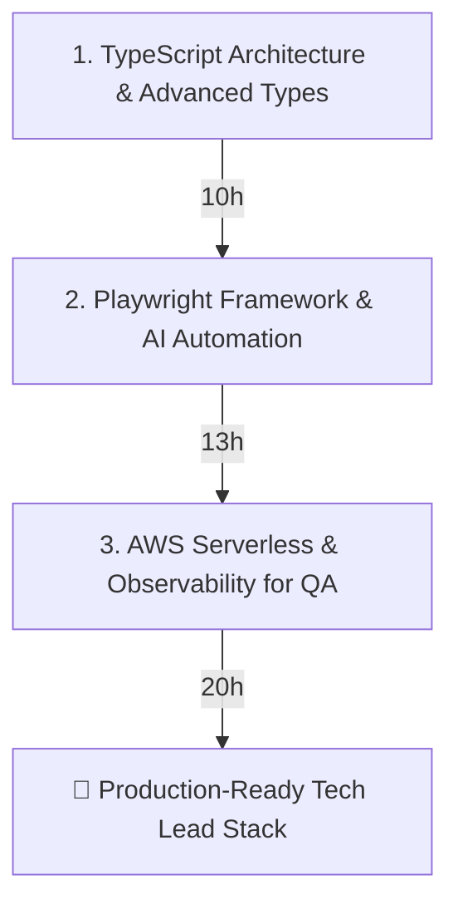

# QA Tech Lead Training Path

Welcome to the **QA Tech Lead Training Path** repository. This workspace contains curated, high-signal learning paths designed specifically for an experienced QA Tech Lead and test automation developer. 

The guides in this repository skip introductory programming concepts and focus entirely on **framework architecture, serverless cloud testing, advanced type safety, and AI-assisted automation**.

---

## 📚 Learning Paths Overview

### 1. [AWS Skill Builder — Serverless QA Path](./aws-skill-builder-courses.md)
**Total Time:** ~20–22 hours  
**Focus:** Cloud testing in a serverless AWS environment (Lambda, SQS, API Gateway, DynamoDB).
- **Core Cloud & Security:** Essential cloud vocabulary and IAM permissions troubleshooting.
- **Observability:** Mastering Amazon CloudWatch Logs and AWS X-Ray for tracing asynchronous event workflows and debugging test failures.
- **Serverless & DynamoDB QA Focus:** Targeted guidelines on API Gateway, event-driven triggers, Dead Letter Queues (DLQs), and verifying database state without going too deep into developer architecture.

### 2. [TypeScript — Tech Lead Learning Path](./typescript-learning-path.md)
**Total Time:** ~10 hours  
**Focus:** Advanced type systems, runtime schema validation, and tooling for automation frameworks.
- **Advanced Types & Generics:** Utility types (`Partial`, `Pick`, `Omit`), Generics, and Discriminated Unions for building reusable Page Object Models and API clients.
- **Async Patterns & Zod:** Managing parallel test data setup and enforcing runtime API contract validation using Zod.
- **Architecture & AI:** Strict `tsconfig.json` configurations, path aliases (`@pages/*`), and leveraging AI assistants (GitHub Copilot / Cursor) for instant type and schema generation.

### 3. [Playwright — Tech Lead Learning Path](./playwright-learning-path.md)
**Total Time:** ~13 hours  
**Focus:** Enterprise test framework architecture, serverless API testing, CI/CD, and AI self-healing tests.
- **Custom Fixtures & Auth State:** Reusing browser authentication state (`storageState`) to bypass login UIs and replacing traditional hooks with Playwright's dependency injection (`test.extend`).
- **API Testing & Network Mocking:** Using `test.request` for direct serverless backend interaction and `page.route` to mock edge-case network errors (HTTP 500, 429).
- **CI/CD & Zero-Flake Tracing:** Test sharding across CI machines and configuring automatic **Trace Viewer** artifacts on failure.
- **AI-Powered Automation:** Leveraging AI for POM generation, self-healing locators ([ZeroStep](https://zerostep.com/)), and browser agents ([Playwright MCP Server](https://github.com/microsoft/playwright-mcp-server)).

---

## 🎯 Recommended Study Sequence

If you are standardizing your team on a modern **Serverless + TypeScript + Playwright** stack, we recommend tackling the material in this order:

1. **TypeScript First (~10h):** Establish solid typing, Zod schema validation, and project path rules before writing test scripts.
2. **Playwright Second (~13h):** Build out your custom fixtures, API test utilities, CI/CD sharding, and explore AI self-healing integrations.
3. **AWS Serverless Third (~20h):** Master AWS X-Ray and CloudWatch to trace asynchronous Lambda/SQS events triggered by your Playwright API/UI tests.

---

## 💡 Philosophy
> *"To learn new technology without AI nowadays is not worthy."*

Every learning path in this repository incorporates modern AI workflows. As a Tech Lead, your goal is not just to master these tools yourself, but to establish AI-assisted coding patterns, self-healing infrastructures, and automated type generation workflows that multiply your entire team's productivity.
